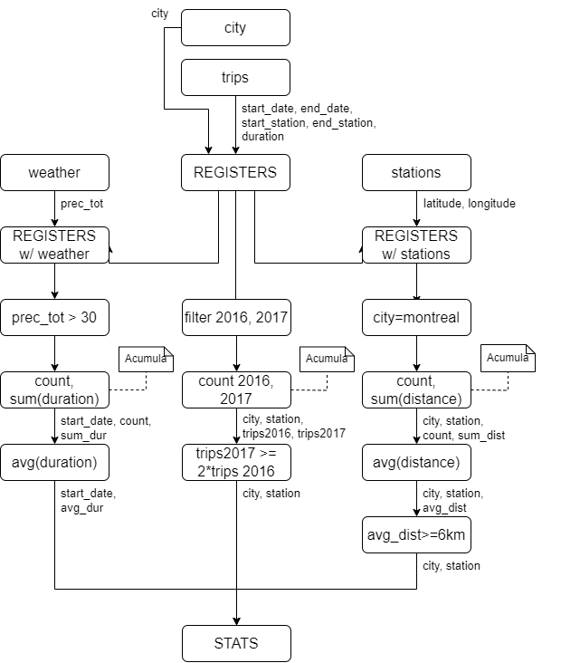
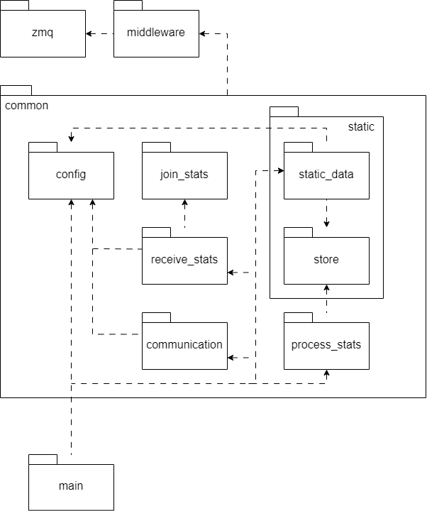

# Bike Rides Analyzer - Docs

- [Bike Rides Analyzer - Docs](#bike-rides-analyzer---docs)
  - [Alcance](#alcance)
  - [Escenarios](#escenarios)
    - [Requerimientos Funcionales](#requerimientos-funcionales)
    - [Casos de Uso](#casos-de-uso)
  - [Arquitectura](#arquitectura)
    - [Cliente](#cliente)
    - [Workers](#workers)
    - [Sink](#sink)
    - [Middleware](#middleware)
  - [Objetivos y Restricciones](#objetivos-y-restricciones)
  - [Vista lógica](#vista-lógica)
    - [Flujo de datos](#flujo-de-datos)
      - [Pipeline](#pipeline)
  - [Vista de procesos](#vista-de-procesos)
    - [Actividades](#actividades)
  - [Vista de desarrollo](#vista-de-desarrollo)
    - [Paquetes](#paquetes)
      - [Client](#client)
      - [Worker](#worker)
      - [Sink](#sink-1)
  - [Vista física](#vista-física)
    - [Despliegue](#despliegue)
    - [Robustez](#robustez)
  - [Evolución del sistema](#evolución-del-sistema)

## Alcance

El proyecto Bike Rides Analyzer consiste en el diseño y desarrollo de un sistema distribuido que analiza registros de viajes realizados con bicicletas en la red pública de grandes ciudades.
Los registros contienen información sobre la duración del viaje, estación de inicio y fin, y se complementa con datos de la ubicación y nombre de las estaciones, así como la cantidad de precipitaciones del día del viaje.

## Escenarios

### Requerimientos Funcionales

- Se solicita un sistema distribuido que analice los registros de viajes realizados con bicicletas de la red pública provista por grandes ciudades.
- Los registros cuentan con el tiempo de duración del viaje, estación de inicio y de fin.
- Se posee también lat., long. y nombre de las estaciones así como la cantidad de precipitaciones del día del viaje.
- Los registros se ingresan progresivamente, al recibirse de cada ciudad.
- Se debe obtener:
  - La duración promedio de viajes que iniciaron en días con precipitaciones >30mm
  - Los nombres de estaciones que al menos duplicaron la cantidad de viajes iniciados en ellas entre 2016 y el 2017.
  - Los nombres de estaciones de Montreal para la que el promedio de los ciclistas recorren más de 6km en llegar a ellas.

### Casos de Uso

- El usuario obtiene las estadísticas finales del sistema.

## Arquitectura

El sistema distribuido Bike Rides Analyzer estará compuesto por varios componentes que trabajarán juntos para procesar los registros de viajes realizados con bicicletas. A continuación, se describen los principales componentes de la arquitectura:

### Cliente

El cliente será el componente principal del sistema, encargado de coordinar el procesamiento distribuido de los registros de viajes. Su función será la de recibir los datos de clima y estaciones, repartir el trabajo entre los diferentes workers y recibir los resultados finales.

### Workers

Los workers serán los encargados de procesar los registros de viajes recibidos del cliente. Cada worker ejecutará el mismo proceso, consistente en enriquecer los datos de los viajes con información adicional sobre las estaciones y el clima y acumular los resultados parciales en un formato que permita calcular las estadísticas requeridas.

### Sink

El sink será el encargado de recibir los resultados parciales enviados por los workers y combinarlos en un único objeto que contendrá todas las estadísticas finales. Este componente enviará el resultado final al cliente para su posterior procesamiento y análisis.

### Middleware

Se utilizará zmq para la comunicación entre los componentes del sistema.

Para la serialización y deserialización de los mensajes intercambiados entre los componentes, se utiliza un formato basado en csv para los registros y JSON para las estadísticas.

El middleware permite la comunicación utilizando patrones de request-reply, publish-subscribe y push-pull.

## Objetivos y Restricciones

- El sistema debe estar optimizado para entornos multi-computadoras y soportar el incremento de los elementos de cómputo para escalar los volúmenes de información a procesar.
- La comunicación entre los componentes se realiza a través de un middleware específico que se adapta a las necesidades del sistema.
- El sistema debe proveer un mecanismo de graceful quit frente a señales SIGTERM.
- Recepción de registros de viajes progresivamente, a medida que se reciben de diferentes ciudades.
- El soporte de una única ejecución del procesamiento y el manejo de señales SIGTERM.

## Vista lógica

En esta sección se describirán las clases y estados relevantes del sistema, mostrando cómo se relacionan entre sí y cómo cumplen con los requerimientos funcionales y no funcionales.

### Flujo de datos

El siguiente DAG representa el flujo de datos del sistema:



La información de los archivos de clima, estaciones y viajes puede ser agregada en un registro, mientras que la ciudad es un dato implícito de los archivos.

A partir de este registro podemos separar 3 ramas, una para cada estadística requerida.

A continuación, se plantea un modelo a partir del cual transformamos la información de un registro en un objeto que nos permita calcular las estadísticas requeridas.


Se presenta el formato de objeto a partir del análisis previo:

```json
{
  "viajes_con_precipitaciones_mayor_a_30mm": {
    "fecha_1": ["duracion_total", "#viajes"],
    "fecha_N": ["duracion_total", "#viajes"]
  },
  "cantidad_de_viajes": {
    "ciudad": {
      "estacion_1": ["#viajes_2016", "#viajes_2017"],
      "estacion_N": ["#viajes_2016", "#viajes_2017"]
    }
  },
  "estaciones_montreal": {
    "estacion_1": ["tiempo_acumulado", "#viajes"],
    "estacion_N": ["tiempo_acumulado", "#viajes"]
  }
}
```

Podemos ver como esta información puede irse acumulando de manera independiente de manera paralela, y luego ser combinada en un único objeto que contenga la información de todas las estadísticas.

#### Pipeline

De ese modo, se define un pipeline que consiste de los siguientes pasos:

- **Enriquecer datos**: tomar datos de viaje y agregarle información relevante (precipitaciones, distancia, etc)
- **Formatear datos**: dar un formato a partir del cual podamos calcular las estadísticas relevantes
- **Agrupar datos**: juntar la información formateada en un único objeto que sera entregado al cliente


## Vista de procesos

En esta sección se describirán los flujos de secuencia y las actividades relevantes del sistema, mostrando cómo se cumplen con los requerimientos funcionales y no funcionales.

<!--
### Secuencias
-->

### Actividades


Vemos en el diagrama la interacción entre los componentes del sistema.

- El cliente envía los datos de clima a todos los workers, utilizando un patron pub-sub.
- El cliente envía los datos de estaciones a todos los workers, y al sink, utilizando un patron pub-sub.
- El cliente envía los datos de viaje a los workers de manera distribuida, utilizando un patron push-pull.
  - Los clientes procesan los datos según el [pipeline](#pipeline) definido previamente.
- Los workers envían los resultados parciales al sink, que los agrega en un único objeto y los envía al cliente.

## Vista de desarrollo

En esta sección se describirán los componentes y paquetes relevantes del sistema, mostrando cómo se organizan.

### Paquetes

#### Client


#### Worker


#### Sink



## Vista física

La vista física muestra cómo los componentes del sistema se despliegan en la infraestructura de hardware. En nuestro caso, el sistema distribuido está diseñado para ser desplegado en un entorno multi-computadora.

### Despliegue


Los nodos son desplegados de manera independiente, y se comunican entre sí a través de un middleware específico.

El middleware en cuestión se basa en [ZeroMQ](http://zeromq.org/), de modo que no tendremos un nodo centralizado que coordine la comunicación entre los nodos, sino que cada nodo se conectará a los demás nodos que necesite.

### Robustez


Como vemos en el diagrama que, se prevé el escalamiento de workers, a modo de incrementar el computo mediante un modelo de _Worker por Item_.

## Evolución del sistema

Se plantea la posibilidad de seguir desarrollando el sistema, descomponiendo sus partes para poder aprovechar la distribución de los datos y el procesamiento.


